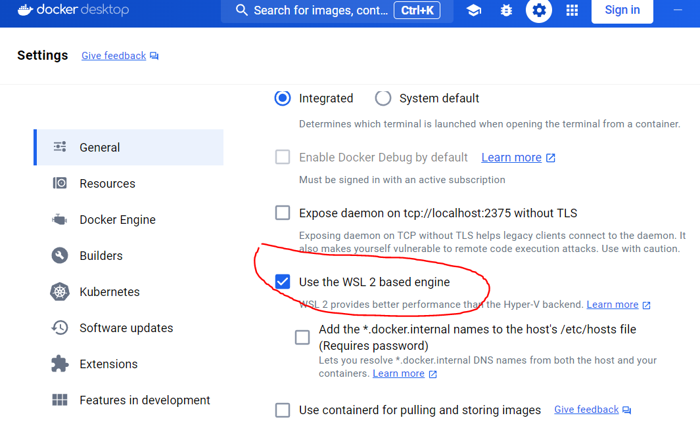
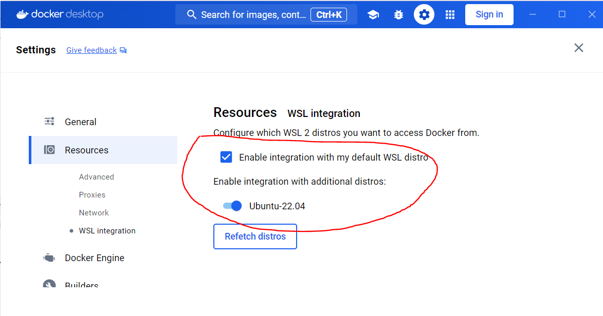

# A guide to setup Ubuntu 24.04 on Windows 10 WSL

Enable Windows Subsystem Linux
run below in Powershell as Administrator

```bash
dism.exe /online /enable-feature /featurename:Microsoft-Windows-Subsystem-Linux /all /norestart
```

Check available Linux distributions
run below in Powershell
```bash
> wsl -l -o
The following is a list of valid distributions that can be installed.
Install using 'wsl.exe --install <Distro>'.

NAME                                   FRIENDLY NAME
Ubuntu                                 Ubuntu
Debian                                 Debian GNU/Linux
kali-linux                             Kali Linux Rolling
Ubuntu-18.04                           Ubuntu 18.04 LTS
Ubuntu-20.04                           Ubuntu 20.04 LTS
Ubuntu-22.04                           Ubuntu 22.04 LTS
Ubuntu-24.04                           Ubuntu 24.04 LTS
OracleLinux_7_9                        Oracle Linux 7.9
OracleLinux_8_7                        Oracle Linux 8.7
OracleLinux_9_1                        Oracle Linux 9.1
openSUSE-Leap-15.5                     openSUSE Leap 15.5
SUSE-Linux-Enterprise-Server-15-SP4    SUSE Linux Enterprise Server 15 SP4
SUSE-Linux-Enterprise-15-SP5           SUSE Linux Enterprise 15 SP5
openSUSE-Tumbleweed                    openSUSE Tumbleweed
```

Choose one distribution from above and install it
```bash
> wsl --install -d Ubuntu-24.04
> wsl -l -v
```
Now that the Ubuntu has been installed, you can launch it from the applications, 
And follow the instructions to setup a user and password for the Ubuntu subsystem.


If the version is 1, we can run below to upgrade to version 2
```bash
wsl --set-version Ubuntu-24.04 2
```
The linux will be restarted for version upgrade.
Now we can set default version to 2 via below command
```bash
 wsl --set-default-version 2
```
## Windows Terminal
I strongly recommand to install Windows Terminal, because it's a good terminal to manage Linux subsystems.
https://learn.microsoft.com/en-us/windows/terminal/install

## Install ZSH
```bash
sudo apt install zsh
```

## Setup ZSH on Ubuntu
the default shell in Ubuntu is bash, add below lines below the first line in ~/.bashrc to switch to ZSH
```bash
if test -t 1; then
exec zsh
fi
```
### install zinit to manage ZSH plugin
create ~/.zshrc with below content
```bash
ZINIT_HOME="${XDG_DATA_HOME:-${HOME}/.local/share}/zinit/zinit.git"
[ ! -d $ZINIT_HOME ] && mkdir -p "$(dirname $ZINIT_HOME)"
[ ! -d $ZINIT_HOME/.git ] && git clone https://github.com/zdharma-continuum/zinit.git "$ZINIT_HOME"
source "${ZINIT_HOME}/zinit.zsh"
```
save and exit, then source it to take effect.

Add 3 lines to .zshrc to install ZSH plugins for syntas highlight, auto-suggestion and auto-complete
```bash
# Add in zsh plugins
zinit light zsh-users/zsh-syntax-highlighting
zinit light zsh-users/zsh-completions
zinit light zsh-users/zsh-autosuggestions
```
Install Powerlevel10k ZSH plugin
```bash
zinit ice depth=1; zinit ligt romkatv/powerlevel10k
```
follow the instructions to setup Powerlevel10k according to your preference

### Install Neovim on Ubuntu
```bash
curl -LO https://github.com/neovim/neovim/releases/latest/download/nvim-linux64.tar.gz
sudo tar -C /opt -xzf nvim-linux64.tar.gz
# add below line to ~/.zshrc
export PATH="$PATH:/opt/nvim-linux64/bin"
# gcc, required by NVIM tree-sitter
sudo apt install gcc
```

### Install Docker on both Windows and Subsystem Ubuntu
please note it only support WSL version 2, you can follow above to upgrade the WSL subsystem to version 2 before get start with Docker

1. Download Docker Desktop and follow the installation instructions.

2. Once installed, start Docker Desktop from the Windows Start menu, then select the Docker icon from the hidden icons menu of your taskbar. Right-click the icon to display the Docker commands menu and select "Settings".


**General


**Resources


Once above is done. you should be able to use docker on both Windows and WSL Ubuntu, but in WSL Ubuntu it will ask you to use Sudo because lack of permissions, now let's fix it by following commands
```bash
sudo usermod -aG docker YourUserName
newgrp docker
```

### Move WSL distro to another Disk drive
The default location of the WSL is in C drive, however there are chances the C drive size is limited and some people may  want to use for example D drive or E drive for WSL, now you can follow below steps to achieve this.

Pre-requisites
Inside WSL distro, update below content, make sure to change the user value to meet your case
```bash
❯ vim /etc/wsl.conf
[boot]
systemd=true
[user]
default=YourUserName
```

```bash
# Please do it on Windows powershell or cmdline
# In my case i want to move the WSL to D drive
# create temp dir to save the vhd file
mkdir -p D:/WSL/tmp

# create dir for new distro going to be imported
mkdir -p D:/WSL/Ubuntu
cd WSL

# stop the original distro
wsl --shutdown Ubuntu-22.04

# please make sure you update wsl to version 2 before export distro
wsl --update

# export WSL distro to the temp dir
wsl --export Ubuntu-22.04 .\tmp\ubuntu-vdisk.vhdx --vhd
wsl -l -v

# create a new distro by importing from the vdhx
wsl --import Ubuntu D:\WSL\Ubuntu .\tmp\ubuntu-vdisk.vhdx --vhd

# start the imported distro
wsl ~ -d Ubuntu -u YourUserName

# set default distro to Ubuntu
wsl --set-default Ubuntu

# check if the imported distro running good, if yes, then let's remove the original one
wsl --unregister Ubuntu-22.04

# reconfigure Docker desktop to integrate with new distro

```
